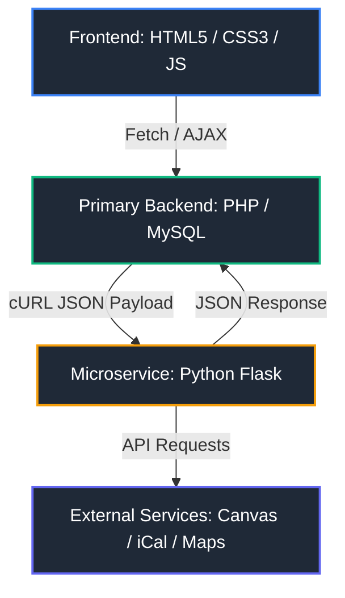
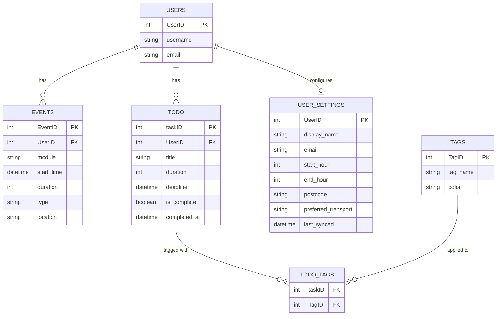

# Smart Timetabler

> A distributed, full-stack scheduling and task optimisation engine built as part of the 1st Year Computer Science curriculum at **The University of Manchester**.

---

## Live Demo

*  **University Students:** [Live Application](https://smarttimetabler.infinityfreeapp.com)
*  **Recruiters & Guests:** [Instant Sandbox/Demo Dashboard](https://smarttimetabler.infinityfreeapp.com/demo_login.php) *(No registration required; pre-loaded with mock timetables and tasks)*
*  **Demo Video:** [Linkedin Post](https://lnkd.in/p/e2NMmkhw)
---

## Project Overview

University schedules change constantly, and manual task management leads to calendar fragmentation and burnout. **Smart Timetabler** automates schedule management by fetching external timetable feeds, monitoring task progress, and automatically executing continuous-block rescheduling algorithms to resolve calendar clashes without user intervention.

---

## Architecture & Key Features

### 1. Decoupled Microservice Architecture
* **Primary Server (PHP):** Handles core HTTP routing, session security, database operations, and user authentication.
* **Algorithm Microservice (Python / Flask):** Offloads resource-heavy calendar parsing and complex array-manipulation math from the main web server to maintain fast response times.

### 2. Smart Rescheduling Algorithm
* Converts incoming task matrices and fixed lecture blocks into continuous availability maps.
* Calculates available continuous time slots during user-configured working hours, dynamically inserting overdue or pending tasks while strictly preventing calendar collisions.

### 3. Asynchronous & Background Pipeline
* **Non-blocking UI:** Utilizes JavaScript `fetch()` and asynchronous workflows (`week_view.js`) to plot calendar blocks without forcing full page reloads.
* **Background Worker (`auto_sync.php`):** Periodically polls university iCal feeds and Canvas API endpoints in the background, keeping calendar states up to date silently.

### 4. Normalized Database & Automated Sweeping
* Designed a fully normalized **MySQL schema** (3NF) featuring junction tables (`ToDo_Tags`) for dynamic, reusable hex-colored tags.
* Implemented automated database cleanup logic to permanently purge completed tasks 24 hours post-completion timestamp, optimizing storage efficiency.

##  Tech Stack

* **Languages:** PHP, Python 3, JavaScript (ES6+), SQL, HTML5, CSS3
* **Frameworks & Libraries:** Flask, cURL
* **Database:** MySQL
* **Hosting / Infrastructure:** InfinityFree (Primary Web Server & DB), Render (Python API Service)

---

##  Database Schema (ERD)

Authors
Darragh Coleman – University of Manchester
Co-developed alongside team members for the Year 1 Team Project.
